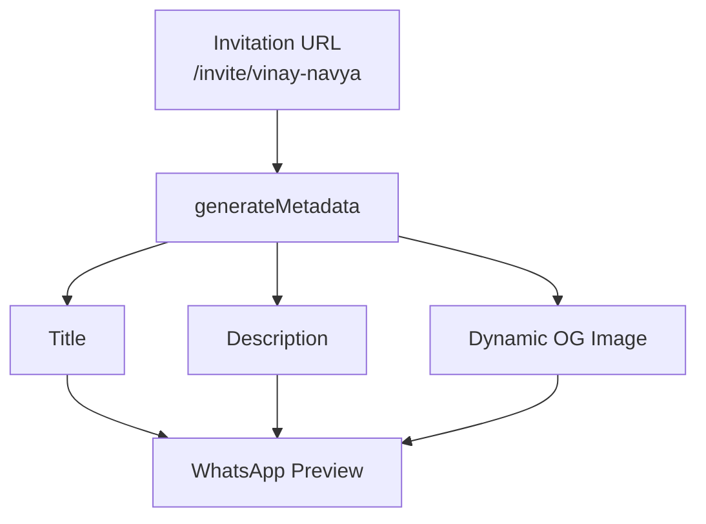

# Vinay + Navya Wedding Invitation

A mobile-first, reusable Next.js wedding invitation for Vercel. The invitation is available at `/invite/vinay-navya`.

## Run locally

```bash
npm install
npm run dev
```

Open `http://localhost:3000/invite/vinay-navya`.

Production checks:

```bash
npm audit
npm run build
npm start
```

## Share previews and Open Graph

Set `NEXT_PUBLIC_SITE_URL` to the public origin in Vercel (for example, `https://your-project.vercel.app`). Each slug generates its own `og:title`, `og:description`, `og:image`, `og:url`, and Twitter card values. The OG image is a public 1200x630 route at `/invite/<slug>/opengraph-image`.

Metadata flow for WhatsApp previews:



Social platforms generally cannot fetch a reliable preview from localhost. After deployment, test the public invitation URL with the [Facebook Sharing Debugger](https://developers.facebook.com/tools/debug/), [LinkedIn Post Inspector](https://www.linkedin.com/post-inspector/), and the Twitter/X Card Validator when available. Re-scrape the URL after changing metadata.

## Deploy to Vercel

```bash
git init
git add .
git commit -m "Create wedding invitation"
git branch -M main
git remote add origin <GITHUB_REPOSITORY_URL>
git push -u origin main
```

1. Open Vercel and import the GitHub repository.
2. Add `NEXT_PUBLIC_SITE_URL=https://your-project.vercel.app` to the project environment variables.
3. Deploy and test `https://your-project.vercel.app/invite/vinay-navya`.

## Add another wedding

Add a new entry to `lib/weddings.ts` with a unique slug, wedding data, event list, hero path, photo paths, and `ogTitle`/`ogDescription`. Add its assets under `public/weddings/<slug>/`. The existing `/invite/[slug]` route and dynamic Open Graph image then work automatically.

Optional music can be configured with `music: "/weddings/<slug>/music.mp3"`. The player is hidden until that file exists and never starts audio automatically. No music is currently configured.

## Project notes

- Wedding time is represented with an explicit `+05:30` offset for Asia/Kolkata countdown calculations.
- Reception time is configured as `11:00 AM`.
- The venue button opens the supplied Google share URL in a new tab.
- Supplied photos are used directly and lazy-loaded in the gallery.
